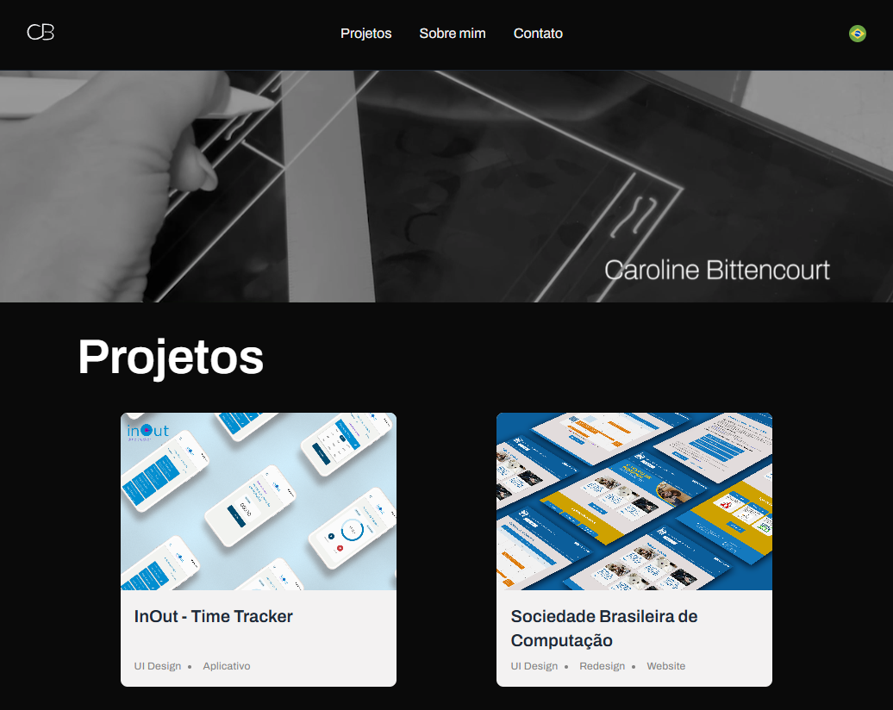

### Carol Bitt

## 🧪 Technologies

- [TypeScript](https://www.typescriptlang.org/)
- [React](https://react.dev/)
- [Vite](https://vitejs.dev/)
- [TanStack Query](https://tanstack.com/query/latest)

## 🚀 Getting started

### Requisites

- [NodeJS](https://nodejs.org/en)
- [Git](https://git-scm.com/)
- [Pnpm](https://pnpm.io/pt/) _(optional)_

### Clone the application

`$ git clone https://github.com/lesada/carol-bittencourt.git`

### Running the project

- Enter each folder, use `npm i` or `pnpm i` to install all dependencies.
- Run the aplication in dev mode using te command `npm run dev` or `pnpm run dev`

###Server
We used a firebase application, you can start your own creating the same tables and using a private api key
